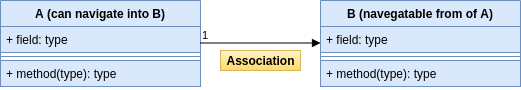

# UML

The Unified Modeling Language (UML) is a general-purpose, standardized modeling language.

## Types of modeling

In UML, there are two main types of modeling: structural modeling and behavioral modeling. Structural modeling focuses on the static structure of the system, its parts, and how they are related to each other.

Main structure diagrams in UML:
* Class diagrams
* Component diagrams
* Package diagrams
* Deployment diagrams

Behavioral modeling shows the dynamic behavior of the components in a system.
Main behavior diagrams in UML:
* Use case diagrams
* Sequence diagrams
* Activity diagrams

## Structure Diagrams

This article approaches the Class Diagram and relationships among structural elements.

### Class Diagrams
Class diagrams show the structure of a software system presenting its classes and their relationships.
A class has methods and fields, each can be public, privated or protected.

### Relationships

UML provides connections to specificate different relationships between its structural elements: classes, components and packages.

An association is a broad term that refers to a semantic relationship between classes.

Aggregation is a relationship in which a child object can exist independently of the parent.

Composition is a relationship in which an object cannot exist independently of another object.

Multiplicity allows you to define the cardinality of a relationship between classes: *, 1, N

A dependency is a type of relationship between UML elements, such as classes, in which one element requires, needs, or depends on another element. The dependency is sometimes referred to as a supplier/client relationship because the supplier provides something to the client. The client is either semantically or structurally dependent on the supplier.

Generalization is the process of abstracting common attributes and operations into a base class. The base class is sometimes referred to as the superclass, base type, or parent class. Generalization is also known as inheritance. The base class contains general attributes, operations, and associations that are shared with all of its subclasses.

 class with 2 specialized (sub)classes")

Realization denotes a relationship in which one element realizes or implements the behavior that another element specifies. A common example of this is when a class implements an interface.

